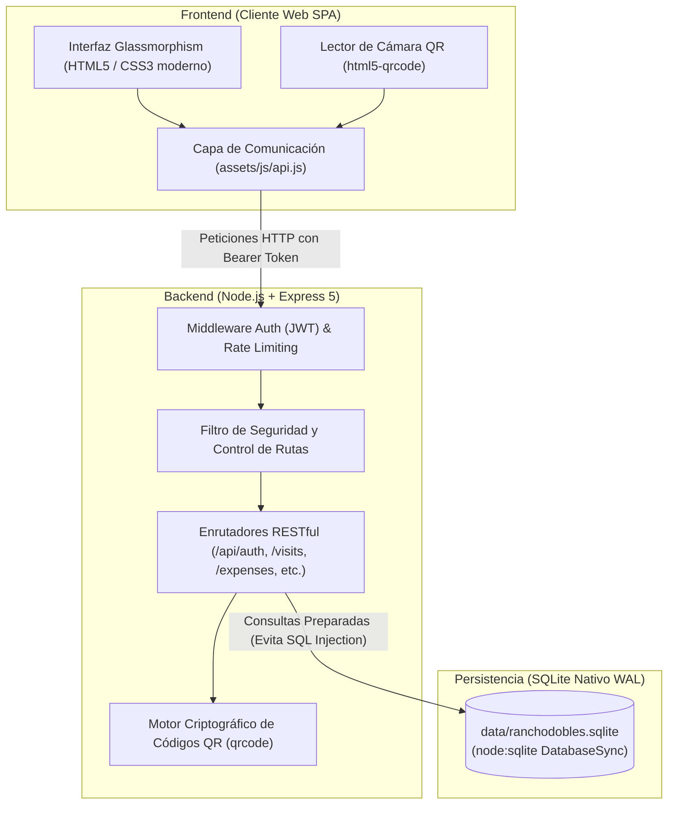
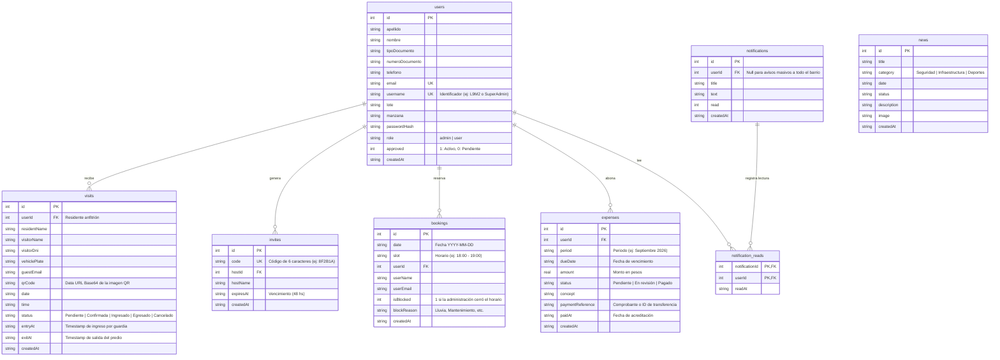
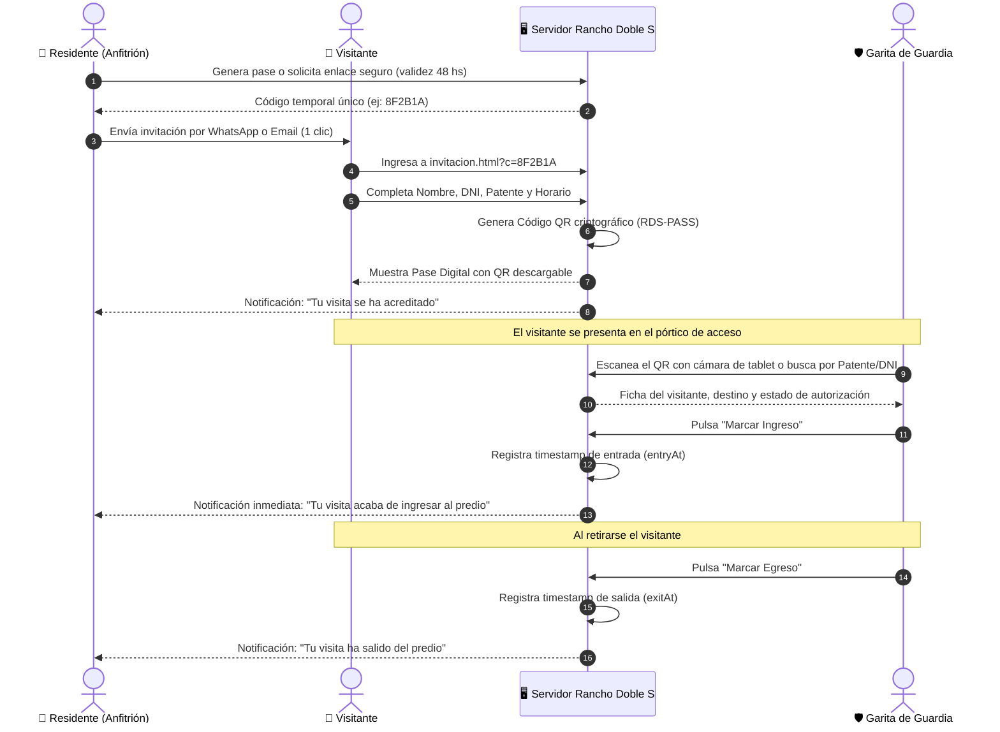

# 🏡 Rancho Doble S — Portal Web Vecinal & Control de Accesos
> **Documento de Arquitectura, Especificación Funcional y Manual del Sistema**  
> *Versión 1.0.0 — Diseñado para presentación técnica y comercial*

---

## 📑 Tabla de Contenidos
1. [Resumen Ejecutivo y Propuesta de Valor](#1-resumen-ejecutivo-y-propuesta-de-valor)
2. [Arquitectura del Sistema y Stack Tecnológico](#2-arquitectura-del-sistema-y-stack-tecnológico)
3. [Modelo de Datos y Entidad-Relación](#3-modelo-de-datos-y-entidad-relación)
4. [Módulos Funcionales y Flujos de Operación](#4-módulos-funcionales-y-flujos-de-operación)
   - 4.1. [Autenticación, Roles y Padrón de Residentes](#41-autenticación-roles-y-padrón-de-residentes)
   - 4.2. [Control de Accesos, Garita de Guardia y Pases QR](#42-control-de-accesos-garita-de-guardia-y-pases-qr)
   - 4.3. [Gestión Integral y Liquidación de Expensas](#43-gestión-integral-y-liquidación-de-expensas)
   - 4.4. [Reserva Inteligente de Canchas Deportivas (Tenis)](#44-reserva-inteligente-de-canchas-deportivas-tenis)
   - 4.5. [Centro de Comunicación, Novedades y Alertas Masivas](#45-centro-de-comunicación-novedades-y-alertas-masivas)
5. [Seguridad, Rendimiento y Buenas Prácticas](#5-seguridad-rendimiento-y-buenas-prácticas)
6. [Guía de Puesta en Marcha y Cuentas de Demostración](#6-guía-de-puesta-en-marcha-y-cuentas-de-demostración)
7. [Conclusión y Escalabilidad Futura](#7-conclusión-y-escalabilidad-futura)

---

## 1. Resumen Ejecutivo y Propuesta de Valor

**Rancho Doble S — Portal Web Vecinal** es una solución integral cliente-servidor orientada a la digitalización, seguridad perimetral y administración centralizada de barrios cerrados, countries y complejos residenciales.

### Problemática Resuelta
Tradicionalmente, las comunidades privadas gestionan su operatoria mediante planillas manuales, grupos de mensajería desorganizados y llamadas telefónicas a la garita de seguridad. Esto genera:
* **Brechas de seguridad en portería:** Ingresos sin registro fehaciente, demoras y falta de trazabilidad de quién autorizó a cada visitante.
* **Morosidad y descontrol de expensas:** Propietarios desinformados de sus deudas y administradores perdiendo tiempo en conciliar comprobantes de transferencia.
* **Conflictos por áreas comunes:** Dobles reservas de turnos deportivos o acaparamiento de canchas.
* **Falta de canales oficiales de emergencia:** Imposibilidad de notificar inmediatamente cortes de agua, obras o alertas de seguridad.

### Solución Implementada
Un ecosistema unificado que opera como **Single Page Application (SPA)** de alto rendimiento, disponible las 24 horas, accesible desde computadoras de escritorio, tablets de garita y teléfonos móviles sin necesidad de instalar aplicaciones pesadas.

```
                  ┌─────────────────────────────────────────┐
                  │          PORTAL VECINAL RDS             │
                  └────────────────────┬────────────────────┘
                                       │
     ┌──────────────────┬──────────────┴─────┬──────────────────┐
     ▼                  ▼                    ▼                  ▼
┌─────────────┐  ┌─────────────┐      ┌─────────────┐    ┌─────────────┐
│  SEGURIDAD  │  │  FINANZAS   │      │  DEPORTES   │    │ COMUNIDAD   │
│ Control QR  │  │ Expensas y  │      │ Turnos con  │    │ Avisos push │
│  en Garita  │  │ Pagos Admin │      │ Reglas Fair │    │ y Novedades │
└─────────────┘  └─────────────┘      └─────────────┘    └─────────────┘
```

---

## 2. Arquitectura del Sistema y Stack Tecnológico

El sistema fue diseñado con una **arquitectura desacoplada de 3 capas** (Presentación, Lógica de Negocio y Persistencia) que garantiza ligereza, velocidad de respuesta instantánea y fácil mantenimiento.



### Tecnologías Utilizadas y Justificación Técnica

| Componente | Tecnología | Justificación de Ingeniería |
| :--- | :--- | :--- |
| **Entorno de Ejecución** | **Node.js 22+** | Ecosistema asíncrono no bloqueante con soporte nativo de base de datos SQLite y librerías criptográficas de alto nivel. |
| **Framework HTTP** | **Express 5.x** | La versión más reciente del estándar web en Node.js, con soporte nativo de promesas en middleware y manejo optimizado de rutas. |
| **Base de Datos** | **SQLite (`node:sqlite`)** | Utiliza la implementación oficial y ultrarrápida nativa de Node.js (`DatabaseSync`). Con el modo **WAL (Write-Ahead Logging)** activado, permite lecturas y escrituras concurrentes sin bloqueos de archivo. Cero dependencias externas de servidores pesados. |
| **Seguridad y Cifrado** | **bcryptjs + JWT** | Cifrado unidireccional de contraseñas con factor de coste de 10 rondas de salting. Autenticación sin estado (*stateless*) basada en tokens **JSON Web Token** válidos por 7 días. |
| **Protección DoS** | **express-rate-limit** | Limitador de peticiones en puntos críticos de login y registro para neutralizar ataques de fuerza bruta y saturación de peticiones. |
| **Frontend** | **Vanilla JavaScript ES6+** | Sin frameworks sobrecargados (cero overhead de bundle de React/Angular). Carga instantánea en cualquier conexión móvil con renderizado reactivo del DOM. |
| **Diseño Visual** | **CSS3 Dark Theme Glassmorphism** | Estética moderna de vanguardia con efectos de desenfoque (`backdrop-filter`), tarjetas translúcidas, fuentes Google Inter y adaptabilidad 100% responsiva (Mobile First). |
| **Hardware de Garita** | **HTML5 QR Code Scanner** | Permite a la guardia de portería usar la cámara de cualquier tablet, smartphone o pistola lectora USB para validar pases al instante. |

---

## 3. Modelo de Datos y Entidad-Relación

El diseño relacional fue normalizado para garantizar integridad referencial y prevenir duplicidad o registros huérfanos mediante claves foráneas y restricciones a nivel de base de datos.



---

## 4. Módulos Funcionales y Flujos de Operación

### 4.1. Autenticación, Roles y Padrón de Residentes

El sistema implementa un esquema **RBAC (Role-Based Access Control)** con dos niveles de privilegio:
1. **Administrador (`admin`):** Acceso total al predio, garita, gestión contable, padrón de vecinos, canchas y avisos masivos.
2. **Propietario / Residente (`user`):** Gestión personal de sus visitas, sus reservas de tenis, sus expensas y su información de perfil.

```
       ┌─────────────────────────────────────────────────────────────┐
       │                 FLUJO DE ALTA DE VECINOS                    │
       └─────────────────────────────────────────────────────────────┘

  [Nuevo Vecino]                      [Servidor]                      [Administración]
         │                                │                                  │
         │─── 1. Formulario de registro ──>│                                  │
         │    (Datos, DNI, Email, Pass)   │── 2. Inserta con approved = 0 ──>│ (Notificación de
         │                                │                                  │  nueva solicitud)
         │                                │                                  │
         │                                │<── 3. Clic en "Aprobar" ─────────│ (Revisión de
         │                                │       (PATCH /admin/users/approve│  identidad de lote)
         │                                │                                  │
         │<── 4. Notificación al vecino ──│── 5. Actualiza approved = 1      │
         │       (Acceso Habilitado)      │                                  │
```

#### Reglas de Negocio Clave
* **Identificadores Catastrales Reales:** Los usuarios de los propietarios se corresponden con su nomenclatura de lote y manzana (ej: `L9M2` para Lote 9, Manzana 2), tal como estipula el reglamento interno.
* **Flexibilidad de Ingreso:** El sistema permite autenticarse indistintamente mediante:
  1. Identificador de Lote (ej: `L9M2` o `SuperAdmin`).
  2. Correo electrónico (ej: `lucia@ranchodobles.com`).
  3. Número de DNI (ej: `30123456`).
* **Seguridad del Perfil:** El residente puede modificar sus teléfonos, correo y actualizar su contraseña con verificación de la clave anterior, pero no puede alterar su usuario de lote asignado por administración.
* **Padrón Activo:** El administrador cuenta con un buscador en tiempo real por nombre, lote, DNI o correo, capacidad para dar de alta residentes de forma inmediata y eliminación con borrado en cascada para evitar datos huérfanos.

---

### 4.2. Control de Accesos, Garita de Guardia y Pases QR

Este es el núcleo de seguridad perimetral del predio. Elimina las llamadas a la guardia y las anotaciones en papel mediante pases digitales con código QR verificables.



#### Capacidades Destacadas del Puesto de Guardia
1. **Lector Óptico con Cámara:** Lee el QR directamente desde la pantalla del celular del visitante usando la cámara de cualquier dispositivo.
2. **Compatibilidad con Pistolas Lectoras:** Admite lectores de códigos de barra/QR conectados por USB al puesto de guardia.
3. **Buscador Inteligente:** Si el visitante no dispone de batería en su teléfono, el guardia ingresa los primeros caracteres de su **Patente**, **DNI** o **Apellido** para localizar el pase.
4. **Filtros Operativos:** La guardia puede filtrar visitas con un toque:
   * 🟢 **En predio:** Vehículos que ingresaron y aún continúan dentro.
   * ⏳ **Esperadas:** Invitaciones programadas para la fecha que aún no arribaron.
   * 🚪 **Egresadas:** Visitas que ya concluyeron su estadía y abandonaron el predio.

---

### 4.3. Gestión Integral y Liquidación de Expensas

El módulo financiero garantiza transparencia, trazabilidad bancaria y elimina el fraude en el informe de transferencias.

```
       ┌─────────────────────────────────────────────────────────────┐
       │             FLUJO DEL CICLO DE VIDA DE EXPENSAS             │
       └─────────────────────────────────────────────────────────────┘

 [ADMINISTRACIÓN]                                             [PROPIETARIO]
        │                                                           │
        │── 1. Emisión de nuevo periodo (ej: Octubre - $150.000) ──>│ (Notificación de
        │      (A todos los activos o a un vecino particular)       │  nueva liquidación)
        │                                                           │
        │                                                           │── 2. Consulta CBU y Alias
        │                                                           │      y realiza transferencia
        │                                                           │
        │                                                           │── 3. Pulsa "Informar Pago"
        │                                                           │      (Adjunta número de transf.)
        │                                                           │      Estado: "EN REVISIÓN"
        │<── 4. Notificación: "Vecino informó pago de expensas" ────│
        │
        │── 5. Revisa en cuenta bancaria y pulsa "Acreditar Pago"
        │      (O "Desestimar" si no impactó)
        │
        │── 6. Estado pasa a "PAGADO" con fecha y hora ─────────────>│ (Notificación: "Pago
                                                                    │  acreditado con éxito")
```

#### Medidas de Control Financiero
* **Prevención de auto-aprobación:** A diferencia de sistemas vulnerables donde el usuario se marca como pagado, en Rancho Doble S el aviso del residente queda en estado estricto de **"En revisión"**.
* **Facultad exclusiva del administrador:** Únicamente el usuario con rol de administración puede validar el ingreso de los fondos y pasar la liquidación a estado **"Pagado"**.
* **Copiar datos bancarios con 1 clic:** La vista del vecino incluye el Alias, CBU, Banco y CUIT oficial del consorcio con botones directos para copiar al portapapeles.

---

### 4.4. Reserva Inteligente de Canchas Deportivas (Tenis)

Organiza el uso de la infraestructura deportiva comunitaria garantizando acceso equitativo y evitando la superposición de turnos.

```
     Grilla de Turnos Diarios (07:00 hs a 22:00 hs — Turnos de 60 minutos)
  ┌───────────────┬───────────────────────────────┬────────────────────────┐
  │ Horario       │ Estado                        │ Acción                 │
  ├───────────────┼───────────────────────────────┼────────────────────────┤
  │ 08:00 - 09:00 │ 🟢 Disponible                 │ [ Reservar Turno ]     │
  │ 09:00 - 10:00 │ 🔴 Reservado: Lucía Sánchez   │ No disponible          │
  │ 10:00 - 11:00 │ 🔵 Tu turno confirmado       │ [ Cancelar Reserva ]   │
  │ 11:00 - 12:00 │ 🚫 Bloqueado: Mantenimiento  │ Suspendido por Admin   │
  │ 14:00 - 15:00 │ ⏳ Horario finalizado         │ Pasado                 │
  └───────────────┴───────────────────────────────┴────────────────────────┘
```

#### Reglas Anti-Acaparamiento (Fair Play Algorítmico)
1. **Límite de 1 turno diario por vecino:** Un residente no puede adueñarse de la cancha durante toda una jornada.
2. **Cupo máximo de 3 reservas activas:** Impide reservas masivas a futuro sin haber utilizado los turnos previos.
3. **Horizonte temporal de 7 días:** Las reservas se abren con una semana de anticipación para evitar bloqueos con meses de anterioridad.
4. **Validación de horarios concluidos:** Si la hora actual superó el inicio o fin del turno, el sistema deshabilita la reserva de forma dinámica.
5. **Protección a nivel motor DB:** La tabla posee la restricción `UNIQUE(date, slot)`. Es físicamente imposible que una condición de carrera (*race condition*) genere dos reservas en el mismo horario.
6. **Supervisión y Bloqueo Climático:** Si llueve o la cancha requiere reparaciones, el administrador puede bloquear turnos individuales o el día entero con 1 clic. El sistema cancela las reservas vigentes y **envía una notificación automática a los afectados** indicando el motivo.

---

### 4.5. Centro de Comunicación, Novedades y Alertas Masivas

El portal funciona como el canal de información verificado de la comunidad, evitando rumores y mensajes extraviados en chats informales.

* **Novedades con Multimedia:** Publicación de comunicados oficiales con imágenes de obras, torneos y reuniones de consorcio.
* **Emisor de Alertas Masivas de Emergencia:** El administrador dispone de plantillas instantáneas para emitir alertas comunitarias que impactan de inmediato en la campanita 🔔 de todos los residentes:
  * 💧 *Corte de suministro de agua por mantenimiento.*
  * ⚡ *Mantenimiento de red eléctrica y microcortes programados.*
  * 🔥 *Inspecciones técnicas de red de gas.*
  * 🚧 *Obras viales y reducción de calzada en acceso principal.*
  * 🛡️ *Alertas preventivas de seguridad.*
* **Lectura Granular Independiente:** Implementa una tabla pivote `notification_reads`. Cuando un residente pulsa *"Marcar todo como leído"*, solo se actualiza su propia visualización, manteniendo la notificación como no leída para el resto de la comunidad.

---

## 5. Seguridad, Rendimiento y Buenas Prácticas

El proyecto fue auditado y blindado contra las vulnerabilidades más frecuentes en aplicaciones web (OWASP Top 10).

```
  ┌────────────────────────────────────────────────────────────────────────┐
  │                    MATRIZ DE SEGURIDAD Y PROTECCIÓN                    │
  ├────────────────────────────────────┬───────────────────────────────────┤
  │ Vector de Amenaza                  │ Mecanismo de Defensa Implementado │
  ├────────────────────────────────────┼───────────────────────────────────┤
  │ Inyección SQL (SQLi)               │ Consultas 100% preparadas y       │
  │                                    │ parametrizadas con DatabaseSync.  │
  ├────────────────────────────────────┼───────────────────────────────────┤
  │ Fuga de Base de Datos y .env       │ Middleware de seguridad que       │
  │                                    │ deniega el acceso a /data, .env y │
  │                                    │ archivos sensibles del sistema.   │
  ├────────────────────────────────────┼───────────────────────────────────┤
  │ Ataques de Fuerza Bruta            │ Rate Limiters (10 intentos máx.   │
  │                                    │ en login por ventana de 15 min).  │
  ├────────────────────────────────────┼───────────────────────────────────┤
  │ Bloqueo del Event Loop en Node.js  │ Métodos criptográficos asíncronos │
  │                                    │ (await bcrypt.compare/hash).      │
  ├────────────────────────────────────┼───────────────────────────────────┤
  │ Suplantación de Pases de Visita    │ Enlaces efímeros con códigos de   │
  │                                    │ seguridad firmados de 48 hs.      │
  ├────────────────────────────────────┼───────────────────────────────────┤
  │ Fuga de Datos a Terceros           │ Generación local de QRs con la    │
  │                                    │ librería nativa 'qrcode'.         │
  ├────────────────────────────────────┼───────────────────────────────────┤
  │ Inyección de Scripts (XSS)         │ Sanitización estricta en frontend │
  │                                    │ y mapeo seguro de entidades HTML. │
  └────────────────────────────────────┴───────────────────────────────────┘
```

---

## 6. Guía de Puesta en Marcha y Cuentas de Demostración

### Requisitos Previos
* **Node.js** v20.x o superior (recomendado Node.js 22 LTS con soporte de `node:sqlite`).
* Navegador web moderno (Chrome, Edge, Safari, Firefox).

### Pasos de Instalación y Ejecución

1. **Instalar dependencias del proyecto:**
   ```bash
   npm install
   ```

2. **Iniciar el servidor en modo desarrollo o producción:**
   ```bash
   # Modo desarrollo (con autoreload ante cambios):
   npm run dev

   # Modo estándar de producción:
   npm start
   ```

3. **Acceder a la aplicación:**
   * Abrir el navegador en: `http://localhost:3000`
   * Si se accede desde un celular en la misma red Wi-Fi: `http://<IP-LOCAL>:3000` (el sistema detecta y genera automáticamente los links de invitación adaptados a la red local).

---

### 👥 Cuentas Preconfiguradas para Demostración

El sistema se inicializa automáticamente con datos de prueba (*seeds*) listos para exponer ante el evaluador:

| Rol | Identificador / Usuario | Correo Electrónico | Contraseña | Estado de Cuenta | Propósito en la Demo |
| :--- | :--- | :--- | :--- | :--- | :--- |
| **Administrador General** | `SuperAdmin` | `admin@ranchodobles.com` | `AdminGTC123` | **Habilitado** | Demostrar panel de administración, control de guardia, emisión de expensas y bloqueos de canchas. |
| **Propietario (Lote 9, Mz 2)** | `L9M2` | `lucia@ranchodobles.com` | `123456` | **Habilitado** | Demostrar cómo invita a sus visitas por WhatsApp, reserva canchas e informa pagos. |
| **Propietario (Lote 14, Mz 1)**| `L14M1` | `nicolas@gmail.com` | `123456` | **Habilitado** | Vecino al día para comprobar la interacción entre distintos residentes. |
| **Solicitante Pendiente** | `L20M4` | `roberto@gmail.com` | `123456` | **Pendiente** | Demostrar el flujo en vivo de aprobación de nuevos vecinos desde el panel admin. |

---

## 7. Conclusión y Escalabilidad Futura

El desarrollo de **Rancho Doble S — Portal Web Vecinal** demuestra solvencia técnica para resolver problemáticas reales de negocio con código limpio, arquitectura robusta y foco en la experiencia de usuario.

### Próximos Pasos y Hoja de Ruta Sugerida
* **Reconocimiento Automático de Matrículas (LPR):** Integración con cámaras de video IP en el pórtico para apertura automática de barreras mediante OCR de patentes autorizadas.
* **Pasarela de Pago Online Integrada:** Conexión con APIs de Mercado Pago o Stripe para cobro automático de expensas por débito o tarjeta con conciliación instantánea.
* **Notificaciones Push Nativas:** Implementación de Service Workers y Web Push API para alertas sonoras en los celulares aún con la pantalla bloqueada.
* **Migración Multi-Predio:** Capacidad de escalar el esquema de datos a un modelo SaaS multi-inquilino (*multi-tenant*) sobre PostgreSQL para brindar servicio a múltiples barrios cerrados simultáneamente.

---

*Documento técnico elaborado para evaluación de competencias profesionales.*  
*Código fuente, base de datos y componentes listos para auditoría técnica.*
